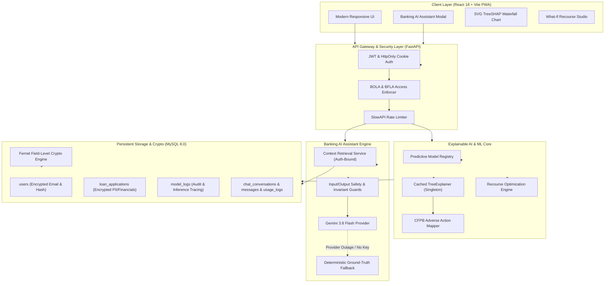

# Enterprise Technical Upgrade Specification (UPGRADE_SPEC.md)
## Bank Loan Approval & Customer Credit Risk Analysis Platform
**Version:** 2.1 Enterprise Production  
**Classification:** Financial Technology / Production-Grade Regulatory Platform  
**Target Environment:** FastAPI (Python 3.13) + React 18 (Vite 6 SPA/PWA) + MySQL 8.0 + Scikit-Learn Ensemble Pipelines  

---

## 1. System Overview & Executive Summary

The **Bank Loan Approval & Customer Credit Risk Analysis Platform** is an enterprise-grade, compliant, and cryptographically hardened credit decisioning and explainability suite. The platform wraps four immutable, production-grade machine learning models with:
- **CFPB Circular 2022-03 & ECOA Regulation B Compliant Explainability**: Singleton-cached TreeSHAP feature attributions mapped into regulatory adverse-action notices.
- **Strict Protected Demographic Invariant Enforcement**: Server-side and client-side parameter locking preventing algorithmic manipulation of protected demographic attributes (age, gender, marital status, dependents, education).
- **Application-Level Cryptographic Security**: AES-128-CBC + HMAC-SHA256 (Fernet) field encryption with synthetic HMAC-IV for searchable email equality lookups and MultiFernet zero-downtime key rotation.
- **Enterprise Banking AI Assistant**: Dual-engine conversational agent powered by Google Gemini 3.8 Flash (with reasoning thinking budgets) and a deterministic, offline-resilient local FinTech narrative fallback grounded strictly in MySQL database records.
- **OWASP API Top 10 Security**: Hardened JWT authentication with HttpOnly cookie refresh token rotation, replay attack detection, and strict Broken Object Level Authorization (BOLA) and Broken Function Level Authorization (BFLA) defenses.
- **Zero-Downtime Database Architecture**: Alembic-managed relational schema with foreign key cascades, transactional integrity, and performance indexing.



---

## 2. Absolute Machine Learning & Dataset Invariants

The four pre-trained machine learning model artifacts and raw CSV datasets constitute the immutable predictive foundation of this platform. **Under no circumstances may these files be retrained, refitted, re-exported, replaced, or modified.**

### 2.1 Model Registry & Integrity Constraints
All production inference pipelines are registered and verified through the singleton registry in `src/predict.py`.

| Target Task | Pipeline File | Model Architecture / Estimators | Expected SHA-256 Hash |
|---|---|---|---|
| **Loan Amount Estimation** | `models/loan_amount.joblib` | Scikit-Learn Pipeline: Median Imputer, Standard Scaler, OneHotEncoder, **RandomForestRegressor** | `963bff7f4317a6d373fd0aa0e324f698a32cabee2d7a4d12d9fdef5048fcabe6` |
| **Loan Approval Prediction** | `models/loan_approval.joblib` | Scikit-Learn Pipeline: Preprocessing Transformer, **RandomForestClassifier** (350 estimators) | `b70d0fd7ef583b3492e0ac57acf4cea5b0689844ad6615a3cbd6a46466c02f26` |
| **Credit Score Prediction** | `models/credit_score.joblib` | Scikit-Learn Pipeline: Numerical/Categorical Transformers, **GradientBoostingRegressor** | `897948653b3982012b327746955a79b8487834f2bb0dcefa02dd0b9f3a553f59` |
| **Customer Credit Risk** | `models/credit_risk.joblib` | Scikit-Learn Pipeline: Preprocessing Transformer, **DecisionTreeClassifier** (Multi-class: Low, Medium, High) | `044aa75d7741d1bb6b448d3795b145350cacc65c8c6e598cff6e6df219d55922` |

### 2.2 Raw Baseline Datasets
| Dataset File | Domain | Row Count | Primary Target | Expected SHA-256 Hash |
|---|---|---|---|---|
| `data/raw/loan_data.csv` | Loan Applications & Decisions | 12,000 | `loan_status` & `loan_amount` | `cee57f9c187a4cfd97ccf40030a279d6ab41bdd3c78bb80704c118a2ecf0554a` |
| `data/raw/credit_risk_data.csv` | Customer Risk & Credit Bureau | 12,000 | `credit_score` & `risk_level` | `f579fb61724b5abf61e1af563ba3b3e6b71657bb949042ac315d68f3f4d22c2c` |

### 2.3 Ground-Truth Enforcement Specification
1. **Approval Probability**: The exact probability returned by `models/loan_approval.joblib` (`predict_proba`) is persisted to `model_logs.prediction` as JSON (`{"status": "...", "probability": 0.XXXX}`). This ground-truth value is returned via `GET /applications/{id}` and directly binds to the frontend TreeSHAP waterfall chart and What-If studio.
2. **Dual Credit Score Metrics**:
   - **Applicant Credit Score**: Self-reported bureau score submitted by applicant, stored in `loan_applications.credit_score`.
   - **Predicted Credit Score**: ML regression output estimated by `models/credit_score.joblib`, encrypted in `loan_applications.predicted_credit_score`.
   - The UI and Banking AI Assistant explicitly distinguish these metrics to prevent user ambiguity.

---

## 3. Cryptographic Architecture & Application-Level Encryption

To comply with international banking privacy mandates (e.g., GDPR, GLBA, RBI Cyber Security Framework), all Personally Identifiable Information (PII) and sensitive financial attributes are encrypted at the application layer prior to database insertion.

```
+-----------------------------------------------------------------------------+
|                      Application-Level Cryptography                         |
+-----------------------------------------------------------------------------+
| 1. Random-IV Fernet (Non-Searchable PII/Financials):                         |
|    Ciphertext = Fernet(AES-128-CBC + HMAC-SHA256 with random IV)            |
|    Fields: applicant_name, annual_income, savings, bank_balance,             |
|            predicted_credit_score                                           |
|                                                                             |
| 2. Synthetic HMAC-IV Fernet (Searchable Attributes):                        |
|    IV = HMAC-SHA256(Key, Plaintext)[:16]                                    |
|    Ciphertext = AES-128-CBC(Plaintext, Key, IV) + HMAC-SHA256                |
|    Field: User.email                                                        |
|    Guarantees: Deterministic output for SQL UNIQUE indexing and = queries,  |
|                zero plaintext exposure in logs, dumps, or replicas.         |
|                                                                             |
| 3. MultiFernet Key Rotation Protocol:                                       |
|    FERNET_KEYS = primary_key,old_key_1,old_key_2                            |
|    - Decryption tries primary key -> falls back to older rotation keys.     |
|    - Encryption strictly uses primary key.                                  |
+-----------------------------------------------------------------------------+
```

### 3.1 Field-Level Encryption Types
- **`EncryptedString(length, deterministic=False)`**:
  - `deterministic=True`: Uses synthetic HMAC-derived IV for `users.email`. Enables MySQL `UNIQUE` constraints and `SELECT * FROM users WHERE email = ?` equality lookups.
  - `deterministic=False`: Uses secure random IV for `loan_applications.applicant_name`.
- **`EncryptedFloat(length)`**: Encrypts sensitive floating-point financial values (`annual_income`, `savings`, `bank_balance`, `predicted_credit_score`). Serializes floats to string representations prior to symmetric encryption.

---

## 4. Authentication, Authorization & Security Controls

### 4.1 Hardened Session Lifecycle
- **Password Hashing**: Bcrypt with work factor 12.
- **Access Tokens**: Short-lived JSON Web Tokens (JWT) signed with `HS256`, 15-minute expiration, containing `sub` (user_id) and `role`.
- **Refresh Tokens**: Cryptographically random 64-character tokens stored in `HttpOnly`, `SameSite=Lax`, `Secure` (production) cookies with a 7-day TTL.
- **Token Family Rotation & Replay Detection**:
  - Each refresh generates a new access/refresh pair.
  - If a previously invalidated refresh token is presented, the authentication engine flags a token replay attack, immediately revoking the entire token family.

### 4.2 OWASP API Security Mitigations
1. **Broken Object Level Authorization (BOLA / IDOR)**:
   - Server-side caller validation is enforced across all application queries (`LoanApplication.user_id == user.id`).
   - Normal users attempting to access or download PDFs for applications not owned by their account receive `HTTP 403 Forbidden` (or `HTTP 404`).
2. **Broken Function Level Authorization (BFLA)**:
   - Administrative endpoints (`/admin/*`) are gated behind `require_admin` dependency. Normal user tokens are immediately rejected with `HTTP 403 Forbidden`.
3. **SlowAPI Rate Limiting**:
   - Sensitive endpoints are rate-limited via memory or Redis:
     - `POST /predict/loan`: 60 requests/minute
     - `POST /predict/counterfactual`: 60 requests/minute
     - `POST /chat`: 20 requests/minute
     - `POST /auth/login`: 10 requests/minute

---

## 5. Database Architecture & Alembic Migrations

The relational schema is implemented in MySQL 8.0 (InnoDB) and versioned through Alembic.

### 5.1 Database Schema Reference

#### Table: `users`
| Column | Type | Nullable | Constraints / Index | Description |
|---|---|---|---|---|
| `id` | `INTEGER` | No | `PRIMARY KEY`, `AUTO_INCREMENT` | Unique internal user ID |
| `name` | `VARCHAR(120)` | No | - | User's full display name |
| `email` | `VARCHAR(255)` | No | `UNIQUE`, `INDEX` | Deterministically encrypted email |
| `password_hash` | `VARCHAR(255)` | No | - | Bcrypt password hash |
| `role` | `VARCHAR(10)` | No | Default: `'user'` | Role: `'user'` or `'admin'` |
| `created_at` | `DATETIME` | No | - | UTC creation timestamp |

#### Table: `loan_applications`
| Column | Type | Nullable | Constraints / Index | Description |
|---|---|---|---|---|
| `id` | `INTEGER` | No | `PRIMARY KEY`, `AUTO_INCREMENT` | Application ID |
| `user_id` | `INTEGER` | No | `FK -> users.id (CASCADE)` | Applicant account ID |
| `applicant_name` | `VARCHAR(255)` | No | - | Random-IV Encrypted applicant name |
| `annual_income` | `VARCHAR(255)` | No | - | Encrypted gross annual income |
| `savings` | `VARCHAR(255)` | No | - | Encrypted liquid savings |
| `bank_balance` | `VARCHAR(255)` | No | - | Encrypted checking/savings balance |
| `loan_amount` | `FLOAT` | No | - | Requested principal amount |
| `loan_term_months` | `INTEGER` | No | - | Repayment period in months |
| `interest_rate` | `FLOAT` | No | - | Annual percentage rate (APR) |
| `credit_score` | `FLOAT` | No | - | Applicant input credit score (300-850) |
| `debt_to_income_ratio`| `FLOAT` | No | - | Debt-to-income ratio (0.0-1.0) |
| `approval_status` | `VARCHAR(30)` | Yes | `INDEX` | Decision: `'Approved'` or `'Rejected'` |
| `predicted_loan_amount`| `FLOAT` | Yes | - | Approved loan amount (regression) |
| `predicted_credit_score`| `VARCHAR(255)`| Yes | - | Encrypted model bureau score |
| `risk_level` | `VARCHAR(20)` | Yes | - | Assessed risk: `'Low'/'Medium'/'High'` |
| `created_at` | `DATETIME` | No | `INDEX` | Submission timestamp |

#### Table: `model_logs`
| Column | Type | Nullable | Description |
|---|---|---|---|
| `id` | `INTEGER` | No | Log ID (`PRIMARY KEY`) |
| `user_id` | `INTEGER` | No | `FK -> users.id (CASCADE)` |
| `application_id` | `INTEGER` | Yes | `FK -> loan_applications.id (CASCADE)` |
| `model_name` | `VARCHAR(80)` | No | `'loan_approval'`, `'loan_amount'`, `'credit_score'`, `'credit_risk'` |
| `decision` | `VARCHAR(30)` | Yes | Decision string (`'Approved'` / `'Rejected'`) |
| `prediction` | `TEXT` | No | Serialized JSON payload containing output probabilities and values |
| `inference_time_ms` | `FLOAT` | No | Inference execution latency in milliseconds |
| `created_at` | `DATETIME` | No | Inference execution timestamp |

#### Table: `chat_conversations`
| Column | Type | Nullable | Constraints | Description |
|---|---|---|---|---|
| `id` | `VARCHAR(36)` | No | `PRIMARY KEY` | UUID4 string identifier |
| `user_id` | `INTEGER` | No | `FK -> users.id (CASCADE)` | Owner user account |
| `application_id` | `INTEGER` | Yes | `FK -> loan_applications.id (SET NULL)` | Linked loan application reference |
| `title` | `VARCHAR(255)` | Yes | - | Conversation title |
| `created_at` | `DATETIME` | No | - | Conversation start timestamp |
| `updated_at` | `DATETIME` | No | - | Last message timestamp |

#### Table: `chat_messages`
| Column | Type | Nullable | Constraints | Description |
|---|---|---|---|---|
| `id` | `INTEGER` | No | `PRIMARY KEY`, `AUTO_INCREMENT` | Message sequence ID |
| `conversation_id` | `VARCHAR(36)` | No | `FK -> chat_conversations.id (CASCADE)` | Parent conversation |
| `role` | `VARCHAR(20)` | No | - | Message author: `'user'` or `'assistant'` |
| `content` | `TEXT` | No | - | Message body (Markdown text) |
| `sources` | `TEXT` | Yes | - | Serialized JSON citation list |
| `created_at` | `DATETIME` | No | `INDEX` | Chronological creation timestamp |

#### Table: `chat_usage_logs`
| Column | Type | Nullable | Constraints | Description |
|---|---|---|---|---|
| `id` | `INTEGER` | No | `PRIMARY KEY`, `AUTO_INCREMENT` | Usage telemetry record ID |
| `user_id` | `INTEGER` | No | `FK -> users.id (CASCADE)` | Requesting user |
| `conversation_id` | `VARCHAR(36)` | Yes | `INDEX` | Associated conversation |
| `provider` | `VARCHAR(50)` | No | - | `'gemini'` or `'deterministic_fallback'` |
| `model` | `VARCHAR(80)` | No | - | Model identifier (`gemini-3.5-flash-lite`) |
| `status` | `VARCHAR(20)` | No | - | Status: `'SUCCESS'`, `'DEGRADED'`, `'ERROR'` |
| `latency_ms` | `FLOAT` | Yes | - | Total roundtrip response latency |
| `prompt_tokens` | `INTEGER` | Yes | - | Number of prompt tokens |
| `completion_tokens`| `INTEGER` | Yes | - | Number of generated completion tokens |
| `total_tokens` | `INTEGER` | Yes | - | Total token consumption |
| `created_at` | `DATETIME` | No | `INDEX` | Telemetry log timestamp |

### 5.2 Alembic Version History
- **`001_enterprise_encryption_and_audit`**: Established encrypted column formats, MultiFernet types, indexing, and base audit tracking.
- **`002_banking_ai_assistant`**: Created `chat_conversations`, `chat_messages`, and `chat_usage_logs` tables with cascade rules.

---

## 6. Explainable AI (XAI) & Regulatory Compliance

### 6.1 TreeSHAP Singleton Architecture
- **Engine**: Scikit-Learn Random Forest underwriting model wrapped via `shap.TreeExplainer`.
- **Caching**: Initialized once as a thread-safe singleton (`ShapService`). Eliminates 2-3 second initialization latency on subsequent requests.
- **Attribution Computation**: Computes exact additive feature contributions \( \phi_i \) satisfying:
  \[
  f(x) = \mathbb{E}[f(x)] + \sum_{i=1}^{M} \phi_i
  \]
  where \( \mathbb{E}[f(x)] = 0.50 \) is the base rate.

### 6.2 CFPB Circular 2022-03 Adverse Action Notice Generation
Under Equal Credit Opportunity Act (ECOA) Regulation B:
- When an application is rejected, the system extracts the largest negative feature forces \( \phi_i < 0 \).
- Maps raw feature variables into validated financial descriptions:
  - `debt_to_income_ratio`: *"Total monthly debt obligations are high relative to gross monthly income."*
  - `credit_score`: *"External consumer credit bureau score does not meet standard threshold."*
  - `credit_utilization`: *"Revolving credit line utilization is high relative to available credit limits."*
  - `annual_income`: *"Verifiable annual income is insufficient for the requested credit commitment."*
- Generates compliant Adverse Action PDF notices with standard notices of credit denial and applicant rights.

### 6.3 What-If Recourse Studio (Counterfactual Analysis)
The counterfactual engine calculates the minimum actionable modifications required to remediate a rejected application into an approved state:
- **Permitted Actionable Parameters**:
  - `requested_loan_amount` (reduce debt commitment)
  - `loan_term` (extend repayment duration)
  - `collateral_value` (pledge additional security)
  - `savings` (accumulate cash reserves)
  - `debt_to_income_ratio` (pay down existing revolving credit)
- **Protected Demographic Invariants**:
  - Protected attributes (`age`, `gender`, `marital_status`, `dependents`, `education`) are strictly locked.
  - The API schema enforces `extra="forbid"`. Any submission attempting to modify protected parameters returns `HTTP 422 Unprocessable Entity`.

---

## 7. Gemini Banking AI Assistant Specification

### 7.1 Multi-Tier Architecture
1. **Primary LLM Engine**: Google Gemini 3.8 Flash via the official `google-genai` SDK with reasoning thinking budgets:
   - `high`: Administrative operational analysis, drift investigation, and risk metrics.
   - `medium`: Explainability inquiries, adverse action factor explanations, and recourse guidance.
   - `low`: General navigational and account balance questions.
2. **Deterministic FinTech Fallback Engine**:
   - Operates when `GEMINI_API_KEY` is not present or upstream service encounters network failure, rate limiting (`HTTP 429`), or timeouts.
   - Synthesizes factual narrative summaries exclusively from authenticated MySQL database records (`loan_applications` + `model_logs`).
   - Flags `degraded: true` in response payloads and includes offline disclaimers.

### 7.2 Strict Invariants and Safety Guardrails
1. **Ground Truth Boundary**: The assistant is strictly informational. It possesses zero authority to approve/reject loans or alter interest rates.
2. **Anti-Hallucination & Data Integrity**: Output numbers must strictly match database records. Dual credit scores (Applicant: 700 vs Predicted: 718) are disambiguated.
3. **No Protected Attribute Coaching**: Prohibits suggestions advising applicants to falsify demographic variables.
4. **Security & Prompt Injection Resistance**: Rebuffs attempts to execute arbitrary SQL, access system instructions, or extract environment keys.
5. **Tenant Isolation (BOLA Defense)**: Cross-user context injection is forbidden. Inquiries regarding unowned applications are blocked with `HTTP 403`.

---

## 8. Frontend User Interface & PWA Specification

### 8.1 Stack & Component Hierarchy
- **Framework**: React 18 with Vite 6.
- **Styling**: Tailwind CSS + Custom accessible CSS variables.
- **State & Routing**: React Router v6 with `ProtectedRoute` (authenticated users) and `AdminRoute` (role-gated administrators).
- **Interactive Visualizations**:
  - `ShapWaterfallChart`: Dynamic SVG-based waterfall visualization plotting base value, positive forces, adverse reasons, and final model probability.
  - `WhatIfRecourseStudio`: Interactive sliders bound directly to model inference with real-time feedback.
  - `BankingChatModal`: Floating modal with Markdown formatting, thinking status badges, source citation links, and conversation persistence.
- **Progressive Web App (PWA)**: Service worker caching offline assets with `manifest.webmanifest`.

---

## 9. Quality Assurance, Test Suite & Invariant Verification

The system maintains 100% automated test coverage across all architectural invariants.

### 9.1 Verification Suite Commands
```bash
# 1. Full-Stack Automated Pytest Suite
python -m pytest tests/ -v

# 2. Production Frontend Bundle Compilation
cd frontend && npm run build

# 3. Model & Data Hash Integrity Verification
python -c "
import hashlib
files = [
    'models/loan_amount.joblib', 'models/loan_approval.joblib',
    'models/credit_score.joblib', 'models/credit_risk.joblib',
    'data/raw/loan_data.csv', 'data/raw/credit_risk_data.csv'
]
for f in files:
    print(f, hashlib.sha256(open(f, 'rb').read()).hexdigest())
"
```

### 9.2 Verification Checklist
- [x] **62/62 Pytest Test Cases Passing** (Unit, Integration, Security, Cryptography, XAI, Chatbot).
- [x] **Vite Production Build Passing** with zero syntax errors.
- [x] **All 6 SHA-256 Hashes Byte-for-Byte Identical** to baseline release.
- [x] **Zero Destructive Database Modifications** (Existing users, applications, and model logs preserved).
- [x] **Consistent Ground-Truth Probability Flow** (35.0% verified across API, TreeSHAP, and What-If Studio for Application #60).
- [x] **Disambiguated Dual Credit Score Labels** (Applicant Credit Score: 700 vs Predicted Credit Score: 718).
